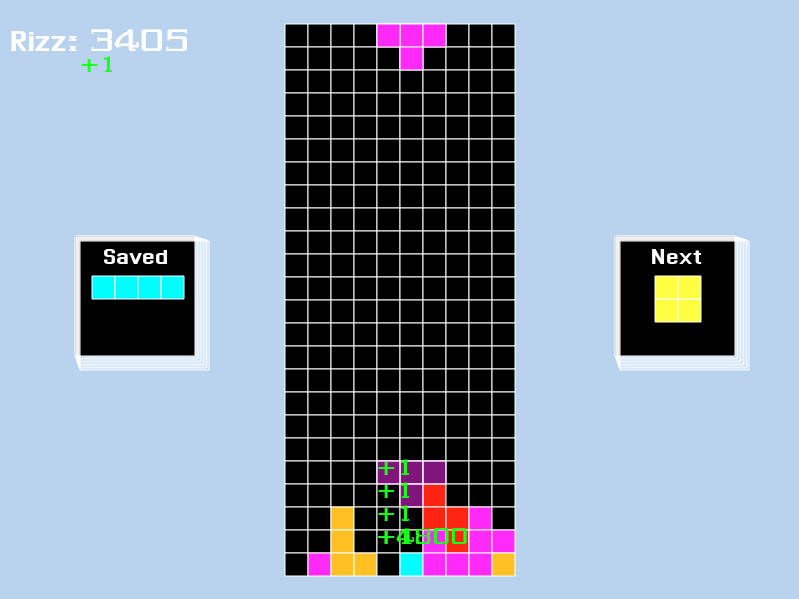

# Tetrizz
A satirical clone of Tetris written in C++. This project was written by 2 students learning C++. The repository has now been updated to be publicly available.

This project was made exclusively for Windows, given the engine (if you can even call it that) we got is not cross-platform.

## Building
To build the project, you will require Visual Studio along with its C++ development tools. You should be able to simply open the solution and build any of the configurations.

## About The Code
The C++ code is very basic and follows C++ 98 style, as we didn't explore modern C++ yet when we wrote the game. Please forgive the basic use of C++ and lack of proper optimization and structure.